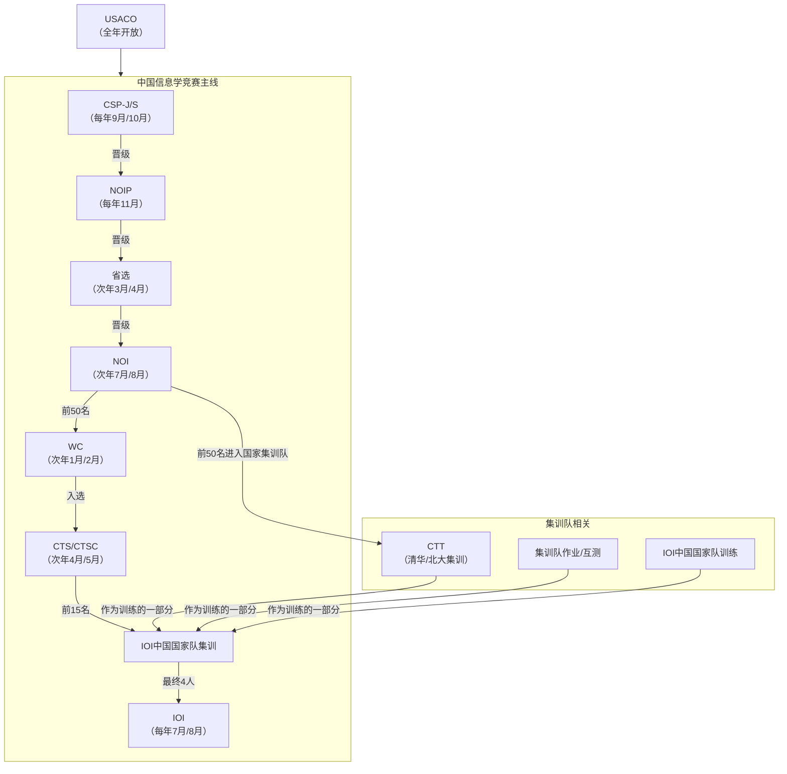

## timeline

2024-07-20 NOI2024
2024-11-30 NOIP2024(NOIP 提高组)
2025-01-28 WC2025

2025-05-19 APIO2025
2025-07-14 NOI2025
2025-11-01 CSP-J/S

这些比赛构成了一个从普及到顶尖、从校内到国际的完整竞赛体系。一位中国选手的典型路径是：
CSP-S → NOIP → 省选 → NOI → (WC) → CTS/CTSC → 国家队集训 → IOI。

## China - CSP-J/S

全称： CCSP Software Proficiency Certification - Junior/Senior
中文： 计算机软件能力认证 - 入门级/提高级
简介： 由中国计算机学会主办，其提高级（CSP-S） 是进入后续NOIP比赛的主要门槛。参赛人数众多，是竞赛之路的起点之一。
时间： 每年9月进行第一轮认证（笔试/初赛），10月进行第二轮认证（机试/复赛）。

## China - NOIP

全称： National Olympiad in Informatics in Provinces
中文： 全国青少年信息学奥林匹克联赛
简介： 在CSP-S中成绩优异的选手才能参加。NOIP的成绩是选拔省队队员的核心依据之一，非常重要。
时间： 每年11月。

## China - Provincial Team Selection (省队选拔)

中文： 省队选拔
简介： 各省通过NOIP成绩和单独的省选考试（通常是两试）来选拔组成该省的代表队，参加当年的NOI。
时间： 通常在次年3月到4月。
    

## China - NOI (National Olympiad in Informatics)

全称： National Olympiad in Informatics
中文： 全国青少年信息学奥林匹克竞赛
简介： 国内最高级别的信息学竞赛，所有省队选手同场竞技。前50名（金牌）将入选国家集训队，并获得清华、北大的保送资格。
时间： 每年7月或8月，通常会持续一周。

## China - WC (Winter Camp) (冬令营 / 候选队选拔)
全称： Winter Camp
中文： 冬令营 / 全国青少年信息学奥林匹克竞赛冬令营
简介： 在NOI之前举办，其成绩是NOI选拔之外的另一条途径，成绩优异者可能获得“候选队员”资格，并参加后续的CTSC。
时间： 每年1月或2月。

## China - CTS/CTSC (China Team Selection) (中国国家队选拔)
全称： China Team Selection / China Team Selection Contest
中文： 中国国家队选拔 / 国际信息学奥林匹克中国队选拔
简介： 由NOI前50名（国家集训队）和WC中的候选队员参加。通过数轮高难度考试，最终选出15人进入下一阶段的IOI中国国家队集训。
时间： 通常在4月或5月。

## China - IOI China Team Training (中国国家队集训)

中文： 中国国家队集训
简介： 由CTS选出的15名选手参加，进行封闭式高强度训练和进一步的考核，最终选出4名正选队员代表中国参加当年的IOI。
时间： 在CTS之后，IOI之前，通常是5月到6月。

## International - IOI (International Olympiad in Informatics)

全称： International Olympiad in Informatics
中文： 国际信息学奥林匹克竞赛
简介： 信息学竞赛领域的最高殿堂，每年举办一次，每个参赛国派出4名选手。
时间： 通常在每年的7月或8月，持续约一周。
备注： 上图中国选手的终极目标就是代表国家出战IOI。

